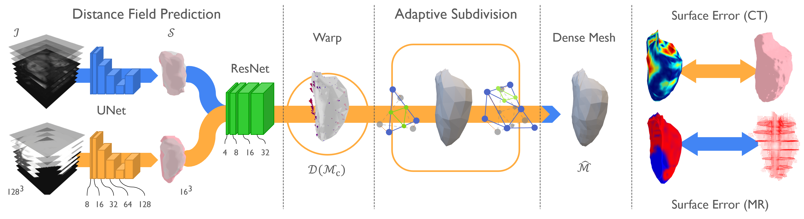

# Adaptive Bi-ventricle Surface Reconstruction from Cardiovascular Imaging

This repository contains scripts and tools for the paper "Adaptive Bi-ventricle Surface Reconstruction from Cardiovascular Imaging". It serves as a reference implementation for the paper. Please note that the code is not optimized for efficiency and may not be bug-free on all machines.



## Contact

Connect with the author: [Malik Teng on LinkedIn](https://www.linkedin.com/in/malik-teng-86085149/)

## Installation

Tested environment: Ubuntu 20.04.6 LTS, Python 3.9.17, and PyTorch 1.12.1

To install:

1. Clone the repository:
```
git clone https://github.com/MalikTeng/MorphiNet
```

2. Install the conda environment:
```
conda env create -f environment.yml
```

3. Activate the environment:
```
conda activate morphinet
```

## Preprocessing

Data preprocessing is required to ensure images, segmentations, and template meshes are in the same space.

1. For new CMR data, use `data_preprocessing.py`. Follow the instructions in the script to produce `.seq.nrrd` files from `.dcm` data.

    _If you have image & segmentation mask for your data, you may check if your data is in the same orientation as required using the Jupyter Notebook `orientation.ipynb`._

    __Please be noted that ensuring your data is in the same orientation is crucial for the network to learn the correct features.__

2. Create a data list JSON file:
```
$ python utils/create_datalist.py \
    --input_dir /path/to/your/preprocessed/data \
    --file_extension .nrrd \    # or .nii.gz based on your data format
    --task_name name_of_your_data \
    --description \             # a description of your data for reference
    --labels {'0': 'background', '1': 'lv', '2': 'lv-myo', '3'; 'rv', '4': 'rv-myo'} \                 
                                # default segmentation labels for left and right ventricular cavity and myocardium
    --modality CT \             # or 'MR' based on your data modality

    # By default, the script will create a crossvalidation list based on the whole dataset provided, if you would like to create a json file only for inference, add the following flag
    --inference
```

## Data Organization

### Data

The data used in the paper is available upon request (details in the paper). Organize your data as follows:

```
DATASET_NAME
├── imagesTr
│   ├── 1.nii.gz (or 1*.nrrd)
│   ├── 2.nii.gz ...
│   └── ...
├── labelsTr
│   ├── 1.nii.gz (or 1*.nrrd)
│   ├── 2.nii.gz ...
│   └── ...
├── imagesTs
│   ├── 1.nii.gz (or 1*.nrrd)
│   ├── 2.nii.gz ...
│   └── ...
└── labelsTs
    ├── 1.nii.gz (or 1*.nrrd)
    ├── 2.nii.gz ...
    └── ...
```

`*Tr` folders contain training and validation data, while `*Ts` folders contain test data.

### Template Meshes

Organize template meshes as follows:

```
template
├── template_mesh-myo.obj   
├── control_mesh-lv.obj
├── control_mesh-myo.obj
└── control_mesh-rv.obj
```

Note: The `template_mesh` is derived from the shape atlas method in [Charlène et al., JCMR 2019](https://www.sciencedirect.com/science/article/pii/S1097664723002144).

## Training

The training process consists of three stages:
1. UNet: Optimizing segmentation UNets
2. ResNet: Learning a continuous distance field
3. GSN: Deforming and refining the template mesh

To run the training process:
```
chmod +x control.sh
./control.sh
```

This calls the `main.py` script. Example parameters:
```
$ python main.py \
    --save_on sct \             # option to run the network on either CT ('sct') or CMR ('mr') data
    --mr_json_dir ./dataset/dataset_taskXX_f0.json # dataset file for CMR data \
    --mr_data_dir /path/to/preprocessed/CMR/data \

    --template_mesh_dir ./template/template_mesh-myo.obj \
    --subdiv_levels 2 \         # the number of GSN layers equates the subdivision level in a Loop surface subdivision method

    --use_ckpt /path/to/your/network/check_point/ \
    --pretrain_epochs 100 \     # 100 epochs to train segmentation UNets
    --train_epochs 150 \        # 50 epochs to train ResNet
    --max_epochs 200 \          # 50 epochs to train GSN
    --val_interval 10 \         # evaluate the network after every 10 epochs

    --hidden_features_gsn 64 \  # size of hidden features for GSN layers
    --pixdim 4 4 4 \            # volume spacing of downsized latent feature from the last UNet layer
    --lambda_0 2.07 \           # coefficient for Chamfer distance term in loss
    --lambda_1 0.89 \           # for Laplacian smoothing term
    --iteration 5 \             # iterations for warping template mesh in the learnt distance field
    --lr 0.001 \                # learning rate
    --batch_size 1 \            # batch size, unfortunately, only support batch size of 1
    --mode online \             # online mode for wandb, can be 'online', 'offline', or 'disabled'

    # add the following if
    --_4d \                     # if your data is 4D, add this flag
    --_mr                       # if you want to train the network solely on MR image data, add this flag
```

## Inference

Use the provided network checkpoint `pretrained/trained_weights/best*.pth` for inference on CMR or CT image data.

Ensure your data is preprocessed and organized similarly to the training data. Use 4D CMR image data in `.nrrd` format or 4D CMR/3D CT image data in `.nii` or `.nii.gz` format. 3D CMR image data in `.nii` or `.nii.gz` is supported but 4D CMR data is not tested.

Example inference command:

```
$ python test.py \
    --save_on cap \                                 # option to run the network on either CT ('sct') or CMR ('mr') data
    \
    # if you want to inference the network on CMR data, add the following arguments
    --mr_json_dir ./dataset/dataset_taskXX_f0.json  # dataset file for CMR data \
    --mr_data_dir /path/to/preprocessed/CMR/data \
    \
    # or inference on CT data, add the following arguments
    --ct_json_dir ./dataset/dataset_taskXX_f0.json  # dataset file for CT data \
    --ct_data_dir /path/to/preprocessed/CT/data \
    \
    --output_dir /path/to/your/output/directory \
    --ckpt_dir /path/to/your/network/check_point \
    --template_mesh_dir ./template/template_mesh-myo.obj \
    \
    --_4d \                                         # if your data is 4D, add this flag
    --_mr                                           # if you want to train the network solely on MR image data, add this flag
```