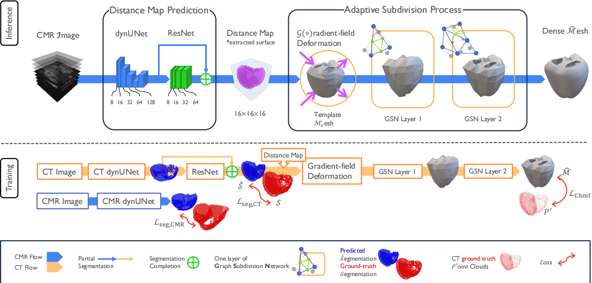

# MorphiNet: A Graph Subdivision Network for Adaptive Bi-ventricle Surface Reconstruction



## Introduction

**MorphiNet** is a novel network that reproduces heart anatomy learned from high-resolution Computed Tomography (CT) images, unpaired with Cardiac Magnetic Resonance (CMR) images. It addresses the limitations of CMR imaging—anisotropy, large inter-slice distances, and misalignments—by encoding anatomical structure as gradient fields that deform template meshes into patient-specific geometries.

A multilayer graph subdivision network (GSN) refines these geometries while maintaining dense point correspondence, suitable for computational analysis. MorphiNet achieves state-of-the-art bi-ventricular myocardium reconstruction and delivers 50× faster inference than comparable neural implicit function methods.

For more details, please refer to our paper: [Arxiv](https://arxiv.org/abs/2412.10985).

## Environment Preparation

You can set up the required environment using Conda. We provide a helper script and an environment configuration file.

### Prerequisites
- Linux
- NVIDIA GPU with CUDA support (CUDA 11.8 recommended)
- Conda

### Installation

1.  **Clone the repository:**
    ```bash
    git clone https://github.com/MalikTeng/MorphiNetV2.git
    cd MorphiNet
    ```

2.  **Create and activate the environment:**
    You can use the provided installation script which sets up the conda environment and installs additional dependencies (like PyTorch Geometric extensions):
    ```bash
    bash install_morphinet.sh
    conda activate morphinet
    ```

    Alternatively, manually create the environment from `environment.yml`:
    ```bash
    conda env create -f environment.yml
    conda activate morphinet
    ```


## External Resources

> [!IMPORTANT]
> The `pretrained` and `template` folders will be provided from a separate share drive. These directories are required for training and inference.

## Dataset Preparation


MorphiNet uses JSON files to manage dataset splits and file paths. These files are located in the `dataset/` directory.

### Structure
The expected data structure involves:
1.  **Raw Data**: Your CT and MR images stored in specific directories.
2.  **Index Files**: JSON files (e.g., `dataset_task20_f0.json`) that map case IDs to their file paths.

### Configuration
When running the training script, you must specify the location of your raw data and the corresponding JSON index files:
- `--ct_data_dir`: Root directory for CT data.
- `--ct_json_dir`: Path to the CT dataset JSON.
- `--mr_data_dir`: Root directory for MR data.
- `--mr_json_dir`: Path to the MR dataset JSON.

**Note**: You can generate or update these JSON files using the utility script provided in `utils/update_dataset_json.py`.

## Usage

MorphiNet supports both training (end-to-end curriculum learning) and inference.

### Training

To start the training pipeline, run `main.py`. The training proceeds in three phases:
1.  **UNet**: Segmentation training.
2.  **ResNet**: Distance field prediction.
3.  **GSN**: Graph Subdivision Network for mesh refinement.

```bash
python main.py \
    --mode online \
    --ct_data_dir /path/to/ct_data \
    --mr_data_dir /path/to/mr_data \
    --max_epochs 100 \
    --batch_size 1
```

**Key Arguments:**
- `--mode`: Setup WandB mode (`online`, `offline`, `disabled`).
- `--max_epochs`: Total number of training epochs.
- `--pretrain_epochs`: Epochs for UNet pre-training.
- `--train_epochs`: Epochs for ResNet training.
- `--batch_size`: Batch size (default: 1).
- `--lr`: Learning rate (default: 1e-3).
- `--use_ckpt`: Path to resume training from a specific checkpoint.

### Testing / Inference

To test a trained model on a specific dataset (e.g., ACDC, MMWHS, CAP):

```bash
python main.py \
    --inference_only \
    --test_dataset acdc \
    --use_ckpt /path/to/checkpoint/dir
```

**Key Arguments:**
- `--inference_only`: Flag to enable inference mode.
- `--test_dataset`: Target dataset (`acdc`, `mmwhs`, `cap`, `scotheart`).
- `--output_root`: Directory to save exported meshes and results.

## Codebase Structure

The codebase is organized into modular components:

```
MorphiNet/
├── dataset/            # JSON files defining dataset splits
├── environment.yml     # Conda environment configuration
├── install_morphinet.sh # Installation helper script
├── main.py             # Main entry point for training and testing
├── run.py              # Factory for creating training/inference pipelines
├── evaluation/         # Metrics and evaluation logic
├── model/              # Neural network architectures
│   ├── networks.py     # Definitions of UNet, ResNet, and GSN
│   ├── parts.py        # Building blocks for networks
│   ├── mesh_operations.py # Differentiable mesh operations
│   └── inference.py    # Inference-specific logic
├── pipeline/           # Core pipeline orchestration
│   ├── orchestrator.py # Manages the training phases (UNet -> ResNet -> GSN)
│   └── testing.py      # Testing pipeline logic
├── training/           # Training components
│   ├── trainer.py      # Training loop implementation
│   ├── validators.py   # Validation logic during training
│   └── losses.py       # Loss functions (Chamfer, Laplacian, etc.)
└── utils/              # Helper utilities
    ├── mesh_metrics.py # Geometric metrics calculation
    ├── process_nrrd_slices.py # Data processing tools
    └── update_dataset_json.py # Dataset index generator
```

## Citation

If you find this work useful in your research, please cite our paper:

```
Deng, Y., Xu, Y., Qian, L., Mauger, C., Nasopoulou, A., Williams, S., Williams, M., Niederer, S., Newby, D., McCulloch, A. and Omens, J., 2024. MorphiNet: A Graph Subdivision Network for Adaptive Bi-ventricle Surface Reconstruction. arXiv preprint arXiv:2412.10985.
```